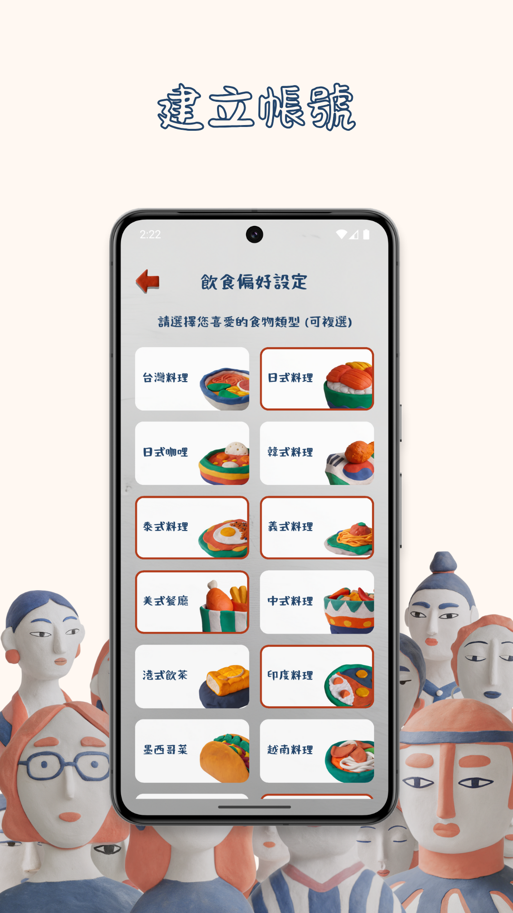
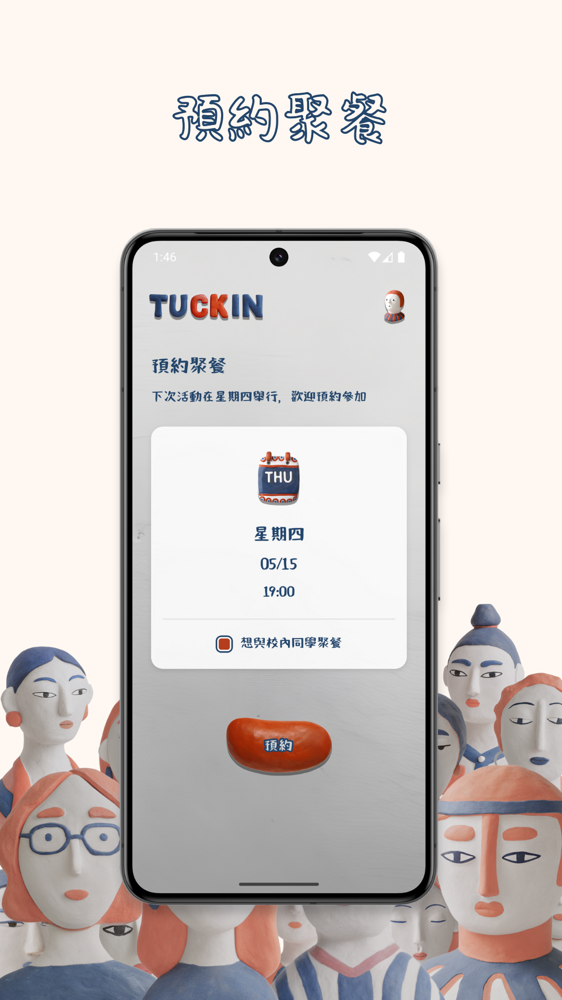
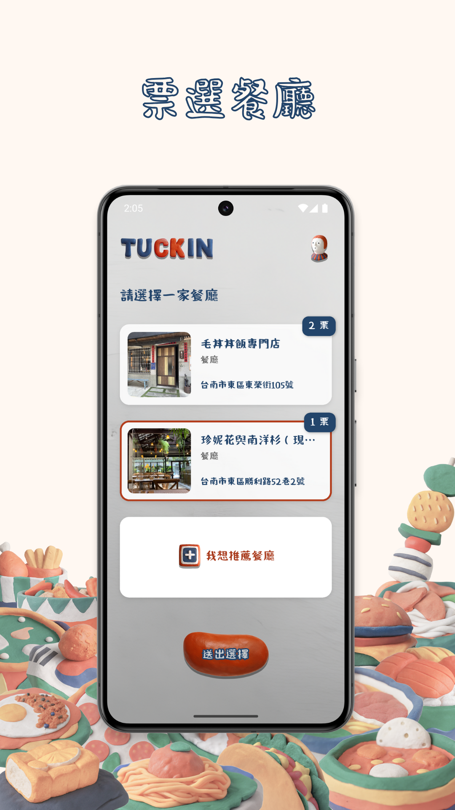
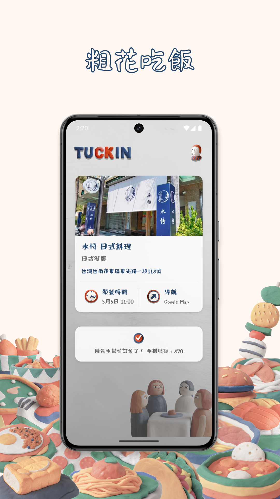

<b>每一次的相遇，都是生命中值得珍藏的片段 ✨</b>

我們打造了 <b>Tuckin</b>，一個在日常中找回連結與溫度的聚餐平臺 🍽️

 

  

 

---

**陌生人只是還沒認識的朋友。**

**Tuckin** 不只是為了吃飯，更是為了在忙碌中，重新感受到與人連結的力量。在一次次的交流中，或許你會遇見志同道合的朋友，或找到讓你笑出聲的瞬間，那些看似微不足道的時刻，正是日常最閃亮的光🌟 

|  |  |  |  |
| ---------------------- | ---------------------- | ---------------------- | ---------------------- |

## 📱 安裝與使用

1. 透過應用商店下載 TUCKIN 應用
2. 使用 Google 登入 (成大 email 會獲得認證)
3. 完成初次設定 (個人資料、飲食偏好、個性測驗)
4. 選擇預約下週聚餐時段
5. 等待系統分組
6. 參與餐廳投票
7. 享受美食與新朋友的相聚時光！ 

## 🔐 安全與隱私

我們**極度重視**用戶的隱私保護，並採取多重措施確保資料安全：

- **Supabase 安全基礎架構：** 我們使用 Supabase 提供的安全可靠的後端服務，保障資料庫和 API 的安全性。
- **Google OAuth 身份驗證：**  透過業界標準的 Google OAuth 進行使用者身份驗證，確保登入流程的安全與便捷。
- **資料加密傳輸：** 所有用戶資料在儲存與傳輸過程中均經過加密處理，防止未經授權的存取。
- **嚴格的隱私政策：** 我們提供明確的使用條款與隱私政策供用戶參考，並承諾遵守相關資料保護規範。

我們致力於為用戶提供一個安全可靠的聚餐平台。 

## ⁉️ Tuckin 常見問題

#### 🔒 為什麼推薦使用學校 Gmail 登入？

Tuckin 鼓勵真實且安全的聚餐環境。透過學校 Gmail 認證，我們能確認你的學生身分，讓你可以選擇只與校內同學分組聚餐。這樣的機制不僅保障參與者身分真實，也提升整體的信任與聚餐品質。 

#### 🤝 預約聚餐後就一定能參加嗎？

大多數情況下是的！但若當週總預約人數為 1、2 或 5 人時，因為我們只安排 3 人以上的聚餐組合，部分用戶可能會無法成功分組。這是為了確保每一場聚餐都有足夠的交流氛圍。 

#### 🙋 為什麼不能選擇只與同性或異性聚餐？

我們希望盡可能簡化分組邏輯，讓每一位報名的用戶都有更高的機會成功參與聚餐。 

#### 🆘 如果聚餐過程中遇到不舒服的狀況，可以怎麼反應？

我們非常重視你的感受。如果有任何讓你感到不適的經驗，請立即寫信與我們聯繫，我們會儘快處理並給予協助。

📧 **[help.tuckin@gmail.com](mailto:help.tuckin@gmail.com)**

#### 📊 Tuckin 如何提升聚餐的出席率？

為了維護聚餐品質，對於多次未出席的用戶，將會依規定進行停權處理，以確保其他參與者的權益與期待不被辜負。 

#### 💡 有新功能的想法或建議，該去哪裡許願？

我們非常歡迎你提供寶貴意見！你可以透過以下方式告訴我們你的願望：

+ **[GitHub Issues](https://github.com/ncchen99/Tuckin/issues)**
+ **[help.tuckin@gmail.com](mailto:help.tuckin@gmail.com)**

#### 🚀 我可以怎麼參與 Tuckin 的開發或貢獻這個專案？

[Tuckin (Deepwiki 頁面)](https://deepwiki.com/ncchen99/Tuckin) 是一個開源專案，歡迎所有對專案有熱情的人加入我們！你可以自由 fork 專案、進行修改，然後提交 Pull Request。我們會認真審核，並考慮在未來的版本中加入你的貢獻。 

## ☕ 支持 Tuckin

> 感謝每一位支持 Tuckin 的朋友! 你們的贊助不僅是對我們的鼓勵，更是讓這個專案能夠持續發展的重要動力。
> 
> **謝謝你們🥹**