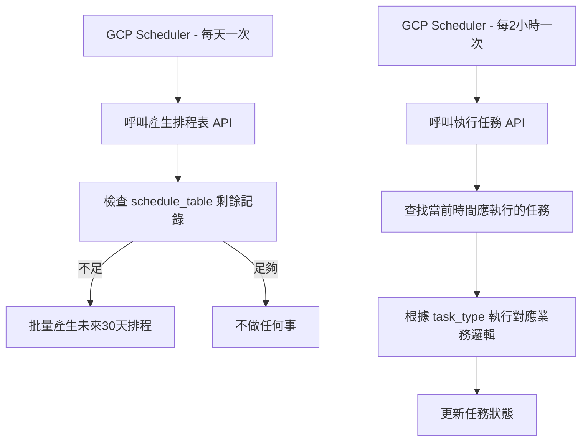

## **排程功能技術文件**

### **1. 功能目的**

此排程系統用於自動化執行以下時間驅動的任務：

* 每週一次的 **大配對**（4人一組）
* **餐廳投票結束**
* **活動結束**
* **評分結束**

透過 GCP Scheduler 定時呼叫後端 API，分別負責：

1. **產生未來的排程表**（確保系統始終有足夠的排程記錄）
2. **執行當前時間段的任務**

---

### **2. 系統架構**

採用 **FastAPI 後端 + Supabase 資料庫 + GCP Cloud Scheduler**

* **Supabase**：儲存 `schedule_table`，紀錄所有未來任務。
* **FastAPI**：提供 API 供 GCP Scheduler 呼叫。
* **GCP Scheduler**：定時呼叫 API，負責自動化產生與執行排程。

---

### **3. 流程說明**

---

### **4. 資料表設計**

#### **schedule\_table**

| 欄位名稱        | 型別      | 說明                                                              |
| --------------- | --------- | ----------------------------------------------------------------- |
| id              | UUID      | 主鍵                                                              |
| task\_type      | TEXT      | 任務類型（match, restaurant\_vote\_end, event\_end, rating\_end） |
| scheduled\_time | TIMESTAMP | 預定執行時間（UTC）                                               |
| status          | TEXT      | 任務狀態（pending, done, failed）                                 |
| created\_at     | TIMESTAMP | 建立時間                                                          |
| updated\_at     | TIMESTAMP | 更新時間                                                          |

---

### **5. API 規格**

#### **(1) 產生排程表 API**

* **路徑**：`POST /api/schedule/generate`
* **用途**：檢查 `schedule_table` 中剩餘的未來排程數量，若不足，則批量產生。
* **邏輯**：

  1. 查詢 `scheduled_time > now()` 的記錄數量
  2. 若小於 **14 天**的數量，則產生未來 30 天的排程
  3. 任務類型依規則循環產生（可透過配置檔控制）
* **呼叫來源**：GCP Scheduler（每天一次）

---

#### **(2) 執行任務 API**

* **路徑**：`POST /api/schedule/execute`
* **用途**：在指定時間段執行對應的任務。
* **邏輯**：

  1. 查詢 `scheduled_time` 在當前時間 ± 容忍範圍內（例如 ±5 分鐘）的 `pending` 任務
  2. 根據 `task_type` 呼叫對應的業務邏輯
  3. 執行完成後更新 `status = done`，失敗則更新為 `failed`
* **呼叫來源**：GCP Scheduler（每 2 小時一次）

---

### **6. GCP Scheduler 設定**

| 任務名稱           | 呼叫 API 路徑            | 頻率           |
| ------------------ | ------------------------ | -------------- |
| generate\_schedule | `/api/schedule/generate` | 每天 00:00 UTC |
| execute\_schedule  | `/api/schedule/execute`  | 每 2 小時一次  |

* 兩個 API 都需設定 API\_KEY 驗證，避免被外部濫用。

---

### **7. 實作注意事項**

1. **安全性**

   * API 需檢查 `X-API-KEY` 是否符合 GCP Scheduler 預設值。
2. **批量插入效率**

   * 使用 Supabase 的批量 Insert API，一次產生多筆任務。
3. **時間處理**

   * 所有時間統一用 UTC 儲存，前端顯示再轉當地時區。
4. **容錯機制**

   * 執行任務時加上 try-except，避免單一錯誤中斷整批任務。

---

這份文件就是一個可以直接丟進 Cursor 的 **開發規格書**，你可以直接依它來建立：

* `schedule_table` migration
* `generate` 與 `execute` 兩支 API
* GCP Scheduler job 設定
