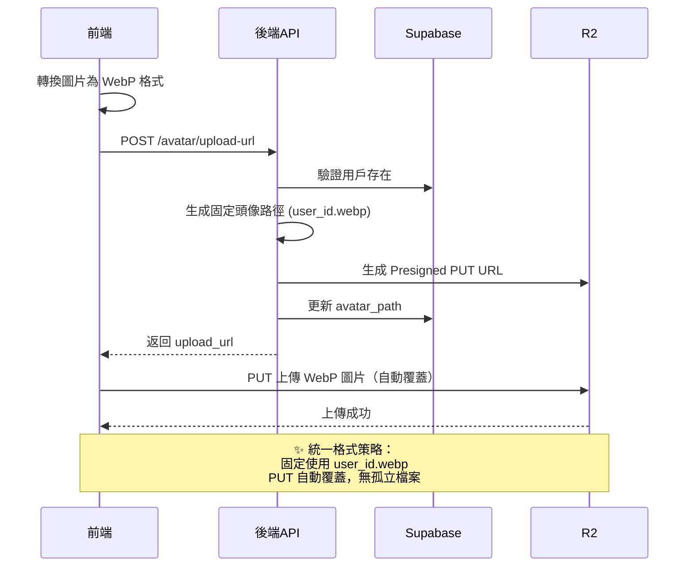
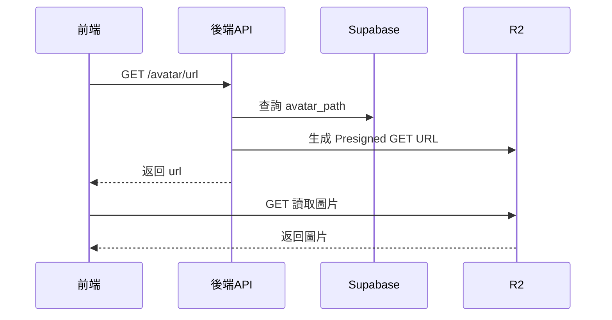

# 用戶頭像上傳 API 說明

## 概述

本系統使用 Cloudflare R2 私有 bucket 來儲存用戶頭像，並透過 Presigned URL 機制實現安全的圖片上傳和讀取。

### 主要特點

- 🔒 **私有儲存**：頭像儲存在私有 bucket 中，只能透過 Presigned URL 存取
- ⚡ **前端直傳**：使用 Presigned PUT URL 讓前端直接上傳到 R2，提升效能
- 🔄 **自動覆蓋**：統一使用 WebP 格式，PUT 操作自動覆蓋，無需刪除舊檔案
- 🎯 **統一格式**：統一使用 WebP 格式，前端負責轉換
- 🚀 **高效能**：省去刪除步驟，完全避免孤立檔案問題
- 📦 **更小體積**：WebP 格式提供更好的壓縮率，節省儲存空間和流量

## 環境配置

在 `.env` 文件中添加以下配置：

```env
R2_PRIVATE_BUCKET_NAME=tuckin-private-images
R2_ACCOUNT_ID=your_account_id
R2_ACCESS_KEY_ID=your_access_key
R2_SECRET_ACCESS_KEY=your_secret_key
```

## 數據庫變更

已在 `user_profiles` 表中添加 `avatar_path` 字段：

```sql
ALTER TABLE user_profiles ADD COLUMN avatar_path TEXT NULL;
```

執行遷移腳本：

```bash
# 在 Supabase SQL Editor 中執行
api/sql/add_avatar_path_migration.sql
```

## API 端點

### 1. 獲取上傳 URL

**端點**：`POST /api/user/avatar/upload-url`

**描述**：獲取 Presigned PUT URL 用於上傳頭像（統一使用 WebP 格式）

**請求參數**：無

**請求示例**：

```http
POST /api/user/avatar/upload-url
Authorization: Bearer {access_token}
```

**響應示例**：

```json
{
  "upload_url": "https://....r2.cloudflarestorage.com/tuckin-private-images/avatars/user_123.webp",
  "avatar_path": "avatars/user_123.webp",
  "expires_in": 3600
}
```

**前端上傳示例（含格式轉換）**：

```dart
import 'package:image/image.dart' as img;

// 1. 讀取並轉換圖片為 WebP 格式
Future<List<int>> convertToWebP(File imageFile) async {
  // 讀取原始圖片
  final bytes = await imageFile.readAsBytes();
  final image = img.decodeImage(bytes);
  
  if (image == null) {
    throw Exception('無法解析圖片');
  }
  
  // 調整尺寸（可選）
  final resized = img.copyResize(image, width: 512, height: 512);
  
  // 轉換為 WebP 格式（質量 85）
  return img.encodeWebP(resized, quality: 85);
}

// 2. 上傳頭像
Future<void> uploadAvatar(File imageFile) async {
  // 轉換為 WebP
  final webpBytes = await convertToWebP(imageFile);
  
  // 獲取上傳 URL
  final response = await dio.post(
    '/api/user/avatar/upload-url',
    options: Options(headers: {'Authorization': 'Bearer $token'}),
  );
  
  final uploadUrl = response.data['upload_url'];
  
  // 上傳到 R2
  await dio.put(
    uploadUrl,
    data: webpBytes,
    options: Options(
      headers: {
        'Content-Type': 'image/webp',
      },
    ),
  );
}
```

### 2. 獲取頭像 URL

**端點**：`GET /api/user/avatar/url`

**描述**：獲取 Presigned GET URL 用於顯示頭像

**請求示例**：

```http
GET /api/user/avatar/url
Authorization: Bearer {access_token}
```

**響應示例**：

```json
{
  "url": "https://....r2.cloudflarestorage.com/tuckin-private-images/avatars/...",
  "expires_in": 3600
}
```

**前端顯示示例**：

```dart
// 1. 獲取頭像 URL
final response = await dio.get(
  '/api/user/avatar/url',
  options: Options(headers: {'Authorization': 'Bearer $token'}),
);

final avatarUrl = response.data['url'];

// 2. 使用 URL 顯示圖片
Image.network(avatarUrl)
```

**錯誤響應**：

```json
{
  "detail": "用戶尚未設置頭像"
}
```

### 3. 刪除頭像

**端點**：`DELETE /api/user/avatar`

**描述**：刪除用戶的頭像

**請求示例**：

```http
DELETE /api/user/avatar
Authorization: Bearer {access_token}
```

**響應示例**：

```json
{
  "message": "頭像已成功刪除"
}
```

**前端刪除示例**：

```dart
final response = await dio.delete(
  '/api/user/avatar',
  options: Options(headers: {'Authorization': 'Bearer $token'}),
);

print(response.data['message']); // 頭像已成功刪除
```

## 工作流程

### 上傳/更新頭像流程



### 顯示頭像流程



## 儲存格式

### 檔案路徑格式

```
avatars/{user_id}.webp
```

**範例**：
```
avatars/550e8400-e29b-41d4-a716-446655440000.webp
avatars/650e8400-e29b-41d4-a716-446655440000.webp
```

**設計說明**：
- ✅ **統一格式**：所有頭像統一使用 WebP 格式
- ✅ **固定路徑**：基於 user_id 的固定路徑
- ✅ **自動覆蓋**：PUT 操作自動覆蓋舊檔案
- ✅ **無孤立檔案**：完全避免副檔名變更導致的孤立檔案問題
- ✅ **更好壓縮**：WebP 比 PNG/JPG 更小，節省 25-35% 空間

### 數據庫儲存

在 `user_profiles` 表中：

| 欄位          | 類型   | 說明                         | 範例                    |
| ------------- | ------ | ---------------------------- | ----------------------- |
| `avatar_path` | `TEXT` | R2 中的檔案路徑（統一 WebP） | `avatars/user_123.webp` |

## 安全性考量

1. **認證**：所有 API 都需要有效的 Bearer Token
2. **授權**：用戶只能操作自己的頭像
3. **時效性**：Presigned URL 有效期為 1 小時（3600 秒）
4. **私有存取**：頭像只能透過 Presigned URL 存取，無法直接公開訪問
5. **格式統一**：統一使用 WebP 格式，前端負責格式轉換
6. **檔案大小**：建議前端限制轉換後的檔案大小（< 500KB）

## 注意事項

1. **URL 時效**：Presigned URL 在 1 小時後會過期，需要重新獲取
2. **格式轉換**：
   - ⚠️ **重要**：前端必須將圖片轉換為 WebP 格式再上傳
   - 使用 `image` 套件進行轉換（Flutter）
   - 建議質量設置為 80-85
3. **圖片處理**：
   - 建議壓縮/調整尺寸至 512x512 或 1024x1024
   - 目標檔案大小 < 500KB
4. **快取策略**：
   - 由於使用固定檔名，更新後可能需要破壞快取
   - 方法：URL 加時間戳 `?t=${timestamp}`
5. **錯誤處理**：
   - 如果用戶未設置頭像，`GET /avatar/url` 會返回 404
   - 上傳失敗時應該重新獲取 upload_url
   - 格式轉換失敗時應給予用戶提示

## 完整範例（Flutter）

```dart
import 'package:dio/dio.dart';
import 'package:image_picker/image_picker.dart';

class AvatarService {
  final Dio _dio;
  
  AvatarService(this._dio);
  
  // 轉換圖片為 WebP 格式
  Future<Uint8List> _convertToWebP(XFile imageFile) async {
    // 讀取原始圖片
    final bytes = await imageFile.readAsBytes();
    final image = img.decodeImage(bytes);
    
    if (image == null) {
      throw Exception('無法解析圖片');
    }
    
    // 調整尺寸為 512x512（保持比例）
    final resized = img.copyResize(
      image, 
      width: 512, 
      height: 512,
      interpolation: img.Interpolation.linear,
    );
    
    // 轉換為 WebP 格式（質量 85）
    final webpBytes = img.encodeWebP(resized, quality: 85);
    
    return Uint8List.fromList(webpBytes);
  }
  
  // 上傳頭像
  Future<void> uploadAvatar(XFile imageFile) async {
    try {
      // 1. 轉換圖片為 WebP 格式
      final webpBytes = await _convertToWebP(imageFile);
      
      print('圖片已轉換為 WebP，大小: ${webpBytes.length} bytes');
      
      // 2. 獲取上傳 URL（無需指定副檔名，後端統一使用 WebP）
      final urlResponse = await _dio.post('/api/user/avatar/upload-url');
      final uploadUrl = urlResponse.data['upload_url'];
      
      // 3. 上傳到 R2
      await _dio.put(
        uploadUrl,
        data: webpBytes,
        options: Options(
          headers: {
            'Content-Type': 'image/webp',
          },
        ),
      );
      
      print('頭像上傳成功！');
    } catch (e) {
      print('上傳失敗: $e');
      rethrow;
    }
  }
  
  // 獲取頭像 URL
  Future<String> getAvatarUrl({bool bustCache = false}) async {
    try {
      final response = await _dio.get('/api/user/avatar/url');
      final url = response.data['url'];
      
      // 如果需要破壞快取（例如剛上傳完），加上時間戳
      if (bustCache) {
        final timestamp = DateTime.now().millisecondsSinceEpoch;
        return '$url?t=$timestamp';
      }
      
      return url;
    } catch (e) {
      if (e is DioException && e.response?.statusCode == 404) {
        // 用戶未設置頭像
        return '';
      }
      rethrow;
    }
  }
  
  // 刪除頭像
  Future<void> deleteAvatar() async {
    try {
      await _dio.delete('/api/user/avatar');
      print('頭像已刪除');
    } catch (e) {
      print('刪除失敗: $e');
      rethrow;
    }
  }
}

// 使用範例
class AvatarScreen extends StatefulWidget {
  @override
  _AvatarScreenState createState() => _AvatarScreenState();
}

class _AvatarScreenState extends State<AvatarScreen> {
  final _avatarService = AvatarService(dio);
  String? _avatarUrl;
  
  @override
  void initState() {
    super.initState();
    _loadAvatar();
  }
  
  Future<void> _loadAvatar() async {
    final url = await _avatarService.getAvatarUrl();
    setState(() {
      _avatarUrl = url;
    });
  }
  
  Future<void> _pickAndUploadImage() async {
    final picker = ImagePicker();
    final image = await picker.pickImage(source: ImageSource.gallery);
    
    if (image != null) {
      // 顯示上傳進度
      setState(() => _isUploading = true);
      
      try {
        await _avatarService.uploadAvatar(image);
        // 重新載入頭像（破壞快取）
        final url = await _avatarService.getAvatarUrl(bustCache: true);
        setState(() {
          _avatarUrl = url;
          _isUploading = false;
        });
        ScaffoldMessenger.of(context).showSnackBar(
          SnackBar(content: Text('頭像上傳成功！')),
        );
      } catch (e) {
        setState(() => _isUploading = false);
        ScaffoldMessenger.of(context).showSnackBar(
          SnackBar(content: Text('上傳失敗: $e')),
        );
      }
    }
  }
  
  @override
  Widget build(BuildContext context) {
    return Scaffold(
      appBar: AppBar(title: Text('我的頭像')),
      body: Center(
        child: Column(
          mainAxisAlignment: MainAxisAlignment.center,
          children: [
            // 顯示頭像
            CircleAvatar(
              radius: 80,
              backgroundImage: _avatarUrl != null && _avatarUrl!.isNotEmpty
                  ? NetworkImage(_avatarUrl!)
                  : null,
              child: _avatarUrl == null || _avatarUrl!.isEmpty
                  ? Icon(Icons.person, size: 80)
                  : null,
            ),
            SizedBox(height: 20),
            // 上傳按鈕
            ElevatedButton(
              onPressed: _pickAndUploadImage,
              child: Text('上傳頭像'),
            ),
            // 刪除按鈕
            if (_avatarUrl != null && _avatarUrl!.isNotEmpty)
              TextButton(
                onPressed: () async {
                  await _avatarService.deleteAvatar();
                  await _loadAvatar();
                },
                child: Text('刪除頭像'),
              ),
          ],
        ),
      ),
    );
  }
}
```

## 疑難排解

### 問題：無法生成上傳 URL

**原因**：R2 配置錯誤

**解決方案**：
1. 檢查 `.env` 中的 R2 配置是否正確
2. 確認 `R2_PRIVATE_BUCKET_NAME` 已設置
3. 檢查 R2 Access Key 是否有效

### 問題：上傳成功但無法讀取

**原因**：Bucket 權限設置問題

**解決方案**：
1. 確認使用的是 Presigned URL 而非直接 URL
2. 檢查 URL 是否過期（有效期 1 小時）

### 問題：更新頭像後仍顯示舊圖片

**原因**：瀏覽器快取了舊圖片（固定檔名）

**解決方案**：
1. 上傳完成後，在 URL 加上時間戳：`?t=${timestamp}`
2. 使用 `bustCache: true` 參數獲取新 URL
3. 清除應用快取

### 問題：圖片格式轉換失敗

**原因**：前端無法解析某些特殊格式的圖片

**解決方案**：
1. 檢查 `image` 套件版本
2. 嘗試使用不同的圖片來源
3. 給用戶友好的錯誤提示

### 問題：上傳後檔案太大

**原因**：壓縮率設置過高或圖片尺寸過大

**解決方案**：
1. 降低 WebP 質量（建議 80-85）
2. 調整圖片尺寸（建議 512x512）
3. 在前端限制原始圖片大小

## 相關文件

- `api/routers/user.py` - API 路由實現
- `api/utils/cloudflare.py` - R2 操作工具函數
- `api/schemas/user.py` - API 請求/響應模型
- `api/sql/add_avatar_path_migration.sql` - 數據庫遷移腳本
- `api/sql/complete_schema.sql` - 完整數據庫架構

