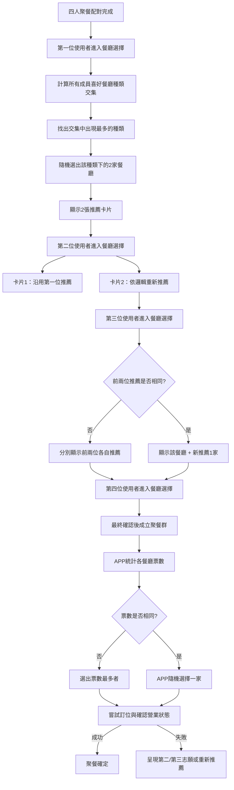

# TUCKIN APP 需求文件

## 1. 概述

### 1.1 APP 名稱
**TUCKIN**

### 1.2 目標用戶
專門為成大學生打造的免費交友與聚餐平台

### 1.3 核心理念
利用智能配對與聚餐活動，促進校內學生間的互動與交流，並藉由趣味化的流程與活動營造輕鬆友善的氛圍

---

## 2. 使用者流程與功能需求

### 2.1 登入與初次設定

- **登入方式：**
  - 使用者以 Email 一鍵登入，若使用成大 email 登入，則自動於用戶名稱旁顯示成大標誌。

- **初次設定流程：**
  - 同意資料使用與儲存條款
  - 設定暱稱
  - 選擇生理性別
  - 輸入一項希望讓他人了解的個人亮點
  - 選擇喜愛的食物種類與菜色
  - 完成個性測驗

---

### 2.2 聚餐預約與配對

- **聚餐預約：**
  - 用戶可選擇下週的 **星期一** 或 **星期四** 晚餐聚餐（每次僅能選擇一個時段）。
  - 可選擇是否僅限成大學生參與（若未勾選，聚餐成員可能包含其他學校用戶）。

- **聚餐配對：**
  - 每週五午夜 12 點，系統根據用戶的個性測驗結果、飲食喜好及其他偏好自動進行配對。
  - **配對條件：**
    - 每個聚餐群組理想為 4 人（建議 2 男 2 女），若某一性別不足，系統需自動調整。
  - **出席確認：**
    - 系統於配對成功後通知用戶，並要求在 **星期六下午 5 點前**確認出席。
    - 用戶確認後若未如期出席，或確認後臨時取消，系統將根據候補池自動補足人數。
    - 最終：若在星期日晚上 5 點前出席人數低於 3 人，該聚餐將被取消（3 人仍可成團，但 4 人為理想）。

---

### 2.3 餐廳選擇與確認流程

- **用餐時間固定：**
  - 聚餐晚餐時間固定為 **晚上 7 點**（不可更改）。

- **餐廳選擇介面：**
  - 用戶在確認出席後進入餐廳選擇頁面。
  - 介面主要包含：
    - 兩張餐廳推薦卡片
    - “我想推薦餐廳”按鈕（點擊後可進入自選餐廳流程）

- **自選餐廳功能：**
  - 進入餐廳類別選擇頁面，提供如日式、韓式、燒烤、特色菜等各種餐廳類型。
  - 用戶可自行輸入 Google 地圖連結（透過 Place API）以新增餐廳資訊。
  - 根據選擇的餐廳類型，展示一份已預先篩選（確認營業時間）的餐廳清單，用戶點選後可開啟 Google Maps 或內嵌小視窗查看詳細資訊。
  - 當用戶在清單中點選「決定」按鈕後，選擇結果將儲存至資料庫中。

- **餐廳推薦邏輯：**

  #### 各階段用戶的推薦流程

  1. **第一位使用者：**
     - 計算該次聚餐 4 位成員喜愛的餐廳種類交集。
     - 從交集中找出出現次數最多的種類。
     - 從該種類中隨機選出 2 家餐廳作為推薦  
       *(若多種類並列最高，則隨機抽取兩個種類，各挑一家)*。

  2. **第二位使用者：**
     - **卡片 1：** 沿用第一位使用者推薦的餐廳。
     - **卡片 2：** 根據相同邏輯重新隨機推薦一間餐廳。

  3. **第三位使用者：**
     - 若前兩位推薦結果相同，則顯示該餐廳加上依邏輯推薦的一家新卡。
     - 若前兩位推薦不同，則顯示兩張各自推薦的餐廳。

  4. **第四位使用者：**
     - 依據前述邏輯產生推薦卡片，完成餐廳選擇後整個聚餐群組進入最終確認階段。

  5. **最終決策（由 APP 自動完成）：**
     - APP 統計所有成員的餐廳選票。
     - 若票數不一致，選出票數最多的餐廳為最終選擇；若票數相同，由 APP 隨機選擇一家。
     - 系統嘗試餐廳訂位並確認餐廳營業狀態：
       - 若訂位成功且餐廳正常營業，聚餐確定；
       - 若訂位失敗或餐廳未營業，則依序呈現第二志願、第三志願，若均失敗則重新依交集邏輯隨機推薦。

  #### Mermaid 流程圖

  ```mermaid
  flowchart TD
      A[四人聚餐配對完成]
      A --> B[第一位使用者進入餐廳選擇]
      
      B --> C[計算所有成員喜好餐廳種類交集]
      C --> D[找出交集中出現最多的種類]
      D --> E[隨機選出該種類下的2家餐廳]
      E --> F[顯示2張推薦卡片]

      F --> G[第二位使用者進入餐廳選擇]
      G --> H[卡片1：沿用第一位推薦]
      G --> I[卡片2：依邏輯重新推薦]
      
      I --> J[第三位使用者進入餐廳選擇]
      J --> K{前兩位推薦是否相同?}
      K -- 是 --> L[顯示該餐廳 + 新推薦1家]
      K -- 否 --> M[分別顯示前兩位各自推薦]
      
      M --> N[第四位使用者進入餐廳選擇]
      L --> N
      N --> O[最終確認後成立聚餐群]
      
      O --> P[APP統計各餐廳票數]
      P --> Q{票數是否相同?}
      Q -- 是 --> R[APP隨機選擇一家]
      Q -- 否 --> S[選出票數最多者]
      
      S --> T[嘗試訂位與確認營業狀態]
      R --> T
      T -- 成功 --> U[聚餐確定]
      T -- 失敗 --> V[呈現第二/第三志願或重新推薦]
  ```

---

### 2.4 聚餐後評分與配對優先順序影響

為鼓勵用戶正確且負責任地參與聚餐，APP 會根據以下四個面向調整用戶未來匹配優先順序：

1. **「令我感到不舒服」評分（核心權重）**
   - **描述：** 當用戶在聚餐中被其他參與者評選為「令我感到不舒服」，代表該用戶的行為或態度嚴重影響聚餐氛圍。
   - **影響：**
     - 若某位用戶在一次聚餐中累計獲得 2 次或以上「令我感到不舒服」評分，其未來匹配優先順序將大幅下降，甚至可能被系統直接排除在優先匹配之外。

2. **參與次數**
   - **描述：** 系統會根據用戶累計的聚餐參與次數來調整匹配優先度。
   - **影響：**
     - 用戶參與次數越多，系統認為該用戶已獲得足夠參與機會，因此在未來匹配中會給予較低的優先順序。
     - 舉例：新用戶參與 1～2 次的匹配優先度較高，而參與超過 10 次的用戶則會因累積參與而相對降低其匹配優先度。

3. **出席狀況**
   - **描述：** 指用戶在確認參與後，是否如期出席聚餐。
   - **影響：**
     - 若用戶確認後未實際出席，則每次未出席會扣除較高的匹配分數（例如，每次扣 10 分，具體數值可依情況調整）。
     - 頻繁未出席的用戶將顯著降低其未來匹配優先順序，系統視此行為為嚴重失信。

4. **確認時取消**
   - **描述：** 指用戶在確認出席後臨時取消參與。
   - **影響：**
     - 每次確認後取消會扣除較低的匹配分數（例如，每次扣 5 分）。
     - 雖然扣分較少，但累計多次仍會對未來匹配順序造成明顯負面影響。

**綜合說明：**
- 「令我感到不舒服」評分為最核心指標，超過 2 次即大幅降低未來匹配優先度。
- 用戶參與次數越多，反而會降低其匹配優先度，以便讓新用戶有更多機會參與。
- 出席狀況與確認後取消行為均會導致匹配分數扣除，未出席的扣分效果更為顯著，而確認後取消則稍低，但累計影響不容忽視。

---

### 2.5 虛擬互動花園

- **花園場景：**
  - 聚餐確認後，用戶進入一個以黏土風格呈現的虛擬花園。
  - 用戶以黏土造型角色出現，展示暱稱、頭像以及自我介紹中的亮點。

- **花園功能：**
  - 中央看板上顯示下週聚餐的時間與地點。
  - 用戶在花園內無法進行文字聊天，但可瀏覽彼此的基本資訊。
  - 系統設計小活動促進互動：
    - 每位用戶隨機抽中一位「小主人」，當天需完成指定任務（任務細則後續討論）。
    - 提供破冰問題清單（如「這週最開心的一件事」等），協助用戶啟動話題。

---

### 2.6 其他附加功能

- **用戶回饋收集：**
  - 聚餐後，APP 主動收集用戶體驗與建議，作為後續優化依據。

- **餐廳與餐廳類型推薦優化：**
  - 根據用戶歷史選擇、評分與偏好，不斷調整及優化餐廳推薦算法。

- **新用戶介紹介面：**
  - 初次使用時，APP 透過多頁介紹：
    - 第一頁：滿版生動影片，展示 APP 概念與特色。
    - 後續 2-3 頁：以圖片與文字說明 APP 的運作流程與核心功能。

- **未來功能擴展：**
  - 允許用戶上傳個人照片，系統根據照片生成黏土風格的個人圖像。
  - 擴展更多社交互動功能，如聊天室、活動推廣等。

---

## 3. 技術與系統需求

### 3.1 資料庫與使用者資料管理
- 儲存用戶基本資料、登入資訊、個性測驗結果、餐廳偏好與推薦記錄。
- 保存聚餐配對、出席確認與評分紀錄。

### 3.2 第三方 API 整合
- **Google Place API：**
  - 驗證餐廳營業時間，提供餐廳詳細資訊與地圖連結。
- **郵件驗證系統：**
  - 檢測用戶是否使用成大 email，並附上校徽標示。

### 3.3 配對與推薦演算法
- 根據用戶個性、飲食偏好及過往評分記錄計算聚餐配對與餐廳推薦。
- 演算法需考慮：
  - 餐廳種類喜好交集的計算。
  - 性別平衡與用戶參與頻率。
  - 評分系統中「令我感到不舒服」的核心權重，並同時納入參與次數、出席狀況及確認後取消行為的扣分效應。

### 3.4 即時通知與確認機制
- 在各關鍵時點（如配對成功、出席確認、餐廳訂位等）推送即時通知。
- 週四晚間推播通知提醒用戶登記聚餐

### 3.5 前端設計與使用者介面
- 界面需直覺、簡潔，整體風格符合黏土質感。
- 流程頁面設計需包含步驟引導、進度條及清晰的提示。

---

## 4. 安全性與隱私保護

- 符合相關資料保護規範與隱私權政策。
- 確保用戶資料在儲存與傳輸過程中的安全性。
- 提供明確的使用條款與隱私政策，供用戶同意。

---

## 5. 未來擴展與優化方向

- **社交功能拓展：**
  - 增加即時聊天、活動推廣及更多社群互動模式。
- **平台擴展：**
  - 考慮未來拓展至其他學校或更廣泛的用戶群。
- **演算法持續優化：**
  - 根據用戶回饋與數據調整配對與推薦邏輯。
- **增強虛擬互動體驗：**
  - 深化虛擬花園與小活動的互動設計，提升用戶參與度。


---

# 所有頁面與畫面元件清單

## ✅1. 新手介紹與說明

### ✅ 1.1 新手介紹頁面
- **全屏介紹影片／動畫**
  - 第一頁展示 APP 核心理念，吸引用戶注意並說明平台精神
- **後續介紹頁面**
  - 圖片與文字說明操作流程與各主要功能
  - 分頁指示器、下一步與跳過按鈕，讓用戶可自由選擇瀏覽完整介紹或直接進入註冊流程

---

## 2. 登入與初次設定

### ✅2.1 登入頁面
- ** Email 輸入欄／一鍵登入按鈕**
  - 用戶使用 google 帳號登入
- ** 成大 email 提示**
  - 若使用成大 email，系統自動在用戶名稱旁顯示藍色勾勾 (同樣為主題色)

### 2.2 初次設定流程
- ** ✅ 條款同意頁**
  - ✅ 條款文字（資料使用與儲存）
  - ✅ 同意按鈕
- ** ✅ 基本資料填寫頁**
  - 暱稱輸入框 (icon顯示assets\images\icon\user_profile.png)
  - 生理性別選擇（單選按鈕或下拉選單）
  - 個人亮點描述輸入框 (關於我，一件想讓別人知道的事情！，輸入框右邊使用 "assets\images\icon\info.png")
- ** ✅ 飲食偏好設定頁**
  - 食物種類／菜色選項[複選]（17 個食物種類卡片，左側是名稱例如：港式料理、日式咖哩、漢堡... 右側是設定右邊出血的食物圖片所以需要安排圖片的位置，選中的卡片出現橘色框線，沒有選中的卡片是灰色框線，圖片：assets\images\dish）
- ** ✅ 個性測驗頁**
  - 系列題目（單選按鈕）：
    ```測驗介紹
        這個測驗只有兩個簡單問題，每個問題有兩個選項，請選擇最符合您的答案。測驗結果將根據您的選擇，將您分類為四種溝通風格之一：分析型、功能型、直覺型或個人型。這些風格反映了您在溝通中的偏好，有助於找到與您相似的人。

        測驗問題
        當您接收資訊時，您更喜歡哪種方式？ (在畫面右下角顯示圖片：assets\images\illustrate\p1.png，與螢幕邊緣有padding)
        a) 以事實和數據為基礎的資訊（例如：統計數字、報告、證據）
        b) 以情感和個人經驗為基礎的資訊（例如：故事、感覺、個人意見）
        當您解釋某件事時，您更喜歡哪種方式？(在畫面右下角顯示圖片：assets\images\illustrate\p2.png，右下角貼合螢幕邊緣)
        a) 從頭到尾，逐步解釋（例如：一步一步說明過程）
        b) 直接切入重點，即使可能跳過一些細節（例如：先說結論，再補充細節）
    ```
    這個部分將2個選項作成上下排列的2張卡片，預測2張卡片都沒有選中，選中之後卡片是橘色框線，沒有選中的卡片是灰色框線，單選
  - 送出按鈕

---

## 3. 聚餐預約與配對

### 3.1 聚餐預約頁面
- **日期選擇按鈕**
  - 用戶可選擇下週星期一或星期四（單選）(選擇2張卡片 卡片上面分別有星期一和星期四的圖片[assets\images\icon\thu.png、assets\images\icon\tue.png]，一樣的設計元素，沒選中的時候背景是白色的選中的時候出現藍色框線，圖片下面都有顯示文字：晚間 7:00 )
- **預約截止時間顯示**
  - 顯示文字提示「預約截止時間：周五午夜 12:00」
- **成大限定勾選框**
  - 選擇是否僅限成大學生參與，預設開啟
- **確認預約按鈕**
  - 提交後進入配對流程

### 3.2 配對狀態頁面
- **匹配進行圖示**
  - 顯示圖示(assets\images\icon\match.png)
  - 下方文字：組合成功會跟你說！ 
- **匹配成功提示**
  - 聚餐群組配對完成通知，並提示用戶進入下一步出席確認

---

## 4. 出席確認與餐廳選擇

### 4.1 出席確認頁面
- **聚餐資訊展示**
  - 固定晚餐時間（晚上 7 點）及基本活動說明
- **出席確認按鈕**
  - 用戶點擊確認參與聚餐
- **倒數計時／截止提醒**
  - 顯示確認截止時間（星期六下午 5 點）
- **參與者簡介**
  - 顯示已確認用戶的基本資料（如暱稱、簡短描述）

### 4.2 餐廳選擇主頁面
- **推薦餐廳卡片**
  - 顯示兩張推薦卡片，每張包含：
    - 餐廳圖片、名稱、類型、營業時間提示
    - 「選擇」按鈕，讓用戶投票
- **“我想推薦餐廳”按鈕**
  - 點擊後進入自選餐廳流程

### 4.3 餐廳自選頁面
- **餐廳類型選擇欄**
  - 提供如日式、韓式、燒烤、特色菜等選項（列表或下拉選單）
- **自訂餐廳輸入框**
  - 用戶可輸入 Google 地圖連結（透過 Place API）以新增餐廳資訊
- **餐廳推薦清單**
  - 根據所選類型篩選餐廳，並確認營業狀態後以卡片形式展示
  - 每張卡片包含餐廳圖片、名稱、營業狀態、查看地圖與「決定」按鈕
- **搜尋欄**
  - 可直接搜尋特定餐廳名稱或類型

### 4.4 最終餐廳確認頁面（系統自動決策）
- **群組投票結果展示**
  - 顯示各推薦餐廳票數統計
- **最終選擇餐廳詳情**
  - 圖片、名稱、地址、聯絡資訊等
- **訂位狀態與確認**
  - 「確認訂位」按鈕
  - 若訂位失敗或餐廳未營業，系統自動呈現第二/第三志願或重新推薦提示

#### 餐廳推薦流程（參考 Mermaid 流程圖）


---

## 5. 聚餐後評分

### 5.1 評分頁面
- **參與者列表**
  - 顯示每位參與者的頭像與暱稱
- **評分選項**
  - 「未出席」按鈕
  - 「令我感到不舒服」按鈕
- **評論欄（可選）**
  - 提供用戶輸入額外評語
- **提交評分按鈕**
  - 一鍵提交所有評分

---

## 6. 用戶個人資料與設定

### 6.1 個人資料頁面
- **頭像展示與上傳**
  - 用戶自訂或系統生成黏土風格頭像
- **基本資料展示**
  - 包含暱稱、生理性別、食物偏好、個性測驗結果
- **編輯按鈕**
  - 允許修改個人資料與偏好設定
- **聚餐歷史記錄**
  - 顯示過往參與聚餐及評分紀錄

### 6.2 設定頁面
- **通知設定**
  - 管理各類推送通知開關
- **隱私與條款**
  - 查看使用條款與隱私政策
- **其他選項**
  - 主題、語言切換等

---

## 7. 通知與訊息

### 7.1 通知頁面
- **通知列表**
  - 顯示聚餐配對成功、出席確認提醒、餐廳訂位狀態等訊息
- **通知詳情**
  - 點擊通知查看詳情與後續操作提示

---

## 8. 幫助與常見問題

### 8.1 FAQ 頁面
- **常見問題列表**
  - 常見疑問及解答
- **聯絡客服按鈕**
  - 提供用戶與客服聯絡的管道
